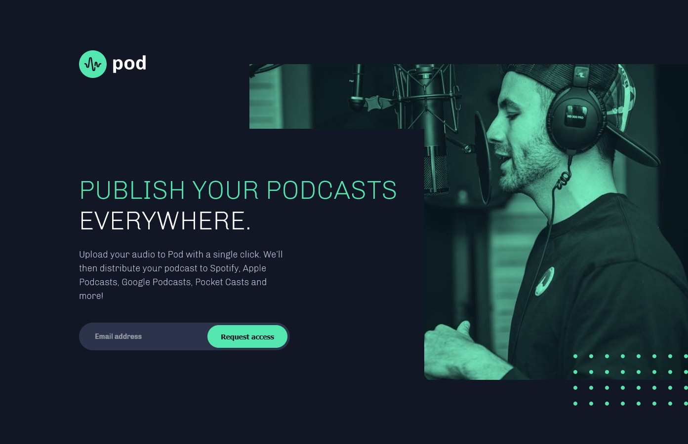

# Frontend Mentor - Pod request access landing page solution

This is a solution to the [Pod request access landing page challenge on Frontend Mentor](https://www.frontendmentor.io/challenges/pod-request-access-landing-page-eyTmdkLSG). Frontend Mentor challenges help you improve your coding skills by building realistic projects.

## Table of contents

- [Overview](#overview)
  - [The challenge](#the-challenge)
  - [Screenshot](#screenshot)
  - [Links](#links)
- [My process](#my-process)
  - [Built with](#built-with)
  - [What I learned](#what-i-learned)
  - [Continued development](#continued-development)
  - [Useful resources](#useful-resources)
- [Author](#author)
- [Acknowledgments](#acknowledgments)

## Overview

### The challenge

Users should be able to:

- View the optimal layout depending on their device's screen size
- See hover states for interactive elements
- Receive an error message when the form is submitted if:
  - The `Email address` field is empty should show "Oops! Please add your email"
  - The email is not formatted correctly should show "Oops! Please check your email"

### Screenshot

### Links

- Solution URL: [solution URL here](https://github.com/nicheweb-frontend-challenges/pod-request-access-landing-page)
- Live Site URL: [live site URL here](https://suspicious-clarke-05f018.netlify.app/)

## My process

### Built with

- Semantic HTML5 markup
- CSS custom properties
- Flexbox
- JavaScript
- Mobile-first workflow

### What I learned

Working with the SVG can be tricky, In this case I had to use the "viewBox" attribute into each SVG file that allow me insert my SVG image like an image element and make it responsive (the image then resize itself according to the container dimensions). So instead of the width-height attributes use (viewBox = "x y width height").
Also I learned that background images overflow is hidden and you can't not make it visible. To achieve the effect of the dots-pattern image I had to embed it into a div and then positioning the div at the desired place.

### Continued development

I have to go deeper into the SVG world and practice more the form-widgets styling. I have to work also in topics like: accessibility/cross-browser testing.

### Useful resources

- [Example resource 1](https://css-tricks.com/scale-svg/) - This helped me scaling SVG images.

## Author

- Website - [Norge Rojas Cerulia](working on it)
- Frontend Mentor - [@niche-web](https://www.frontendmentor.io/profile/niche-web)
- Twitter - [@Nani45670378](https://www.twitter.com/Nani45670378)

## Acknowledgments

To MDN (once again)
